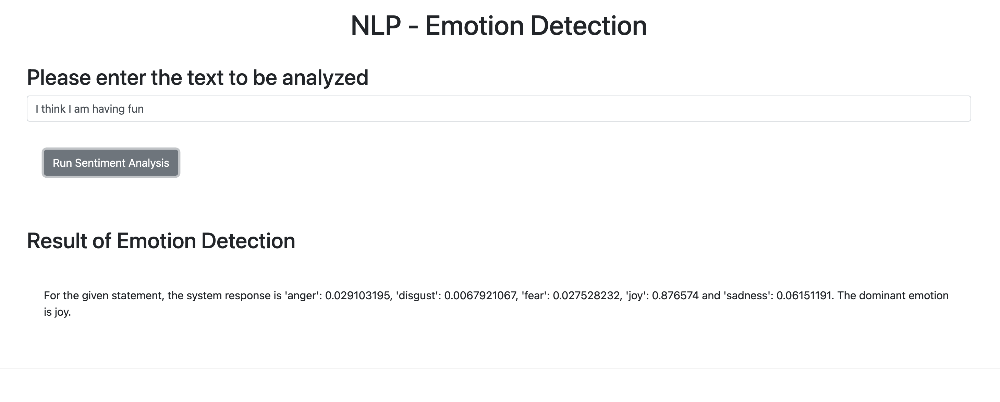

# Emotion Detection Application

Achieved the following milestones:

1. **Created an Emotion Detection Application**: Utilized functions from embeddable AI libraries to build a robust emotion detection application.
2. **Extracted Relevant Information**: Successfully extracted and processed relevant information from the output received from the emotion detection function.
3. **Tested and Packaged the Application**: Implemented comprehensive testing and packaging for the application using the Emotion Detection function.
4. **Web Deployment with Flask**: Completed the deployment of your application using the Flask web framework, making it accessible via a web interface.
5. **Incorporated Error Handling**: Enhanced the application by incorporating error handling mechanisms to account for invalid inputs, ensuring robust performance.
6. **PEP8 Compliance**: Written clean and maintainable code that complies with PEP8 guidelines, achieving a perfect 10/10 score in static code analysis.

# This image shows how the web interface looks like 

